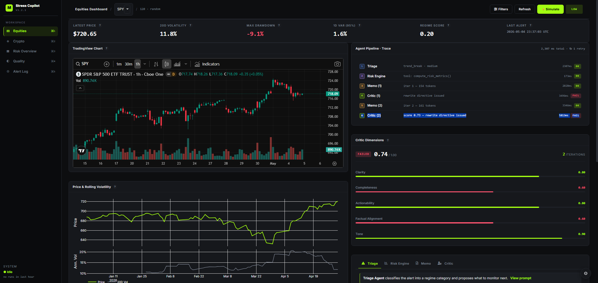
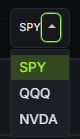
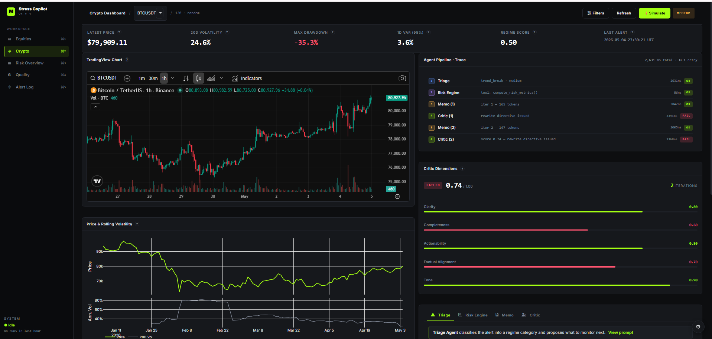
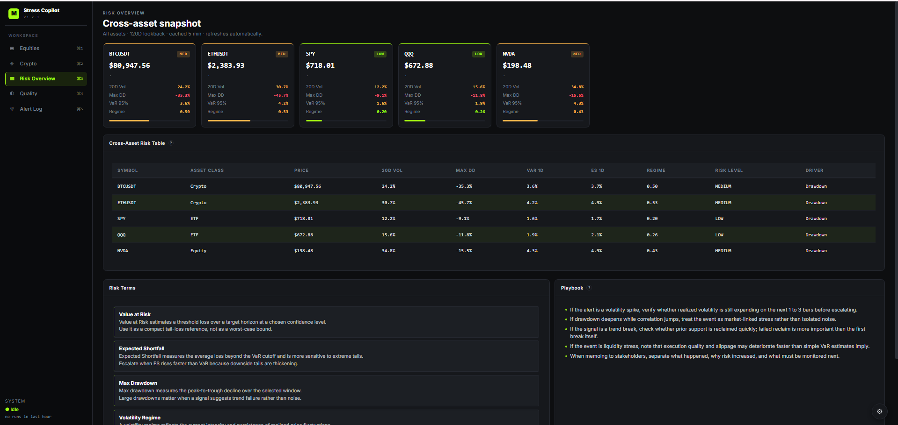
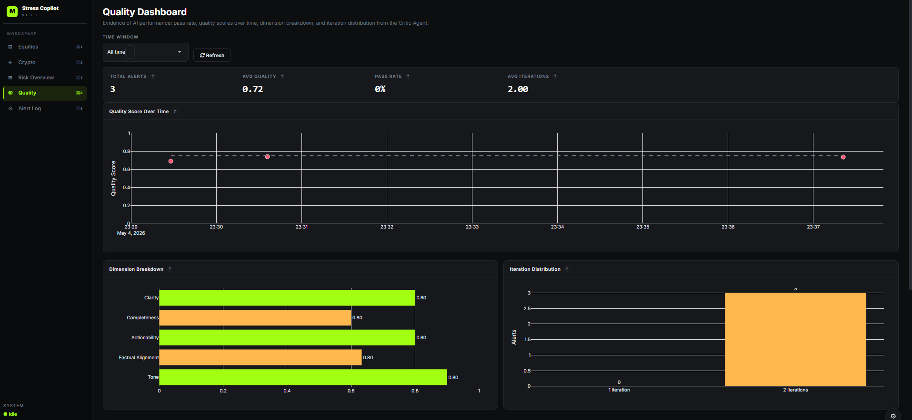
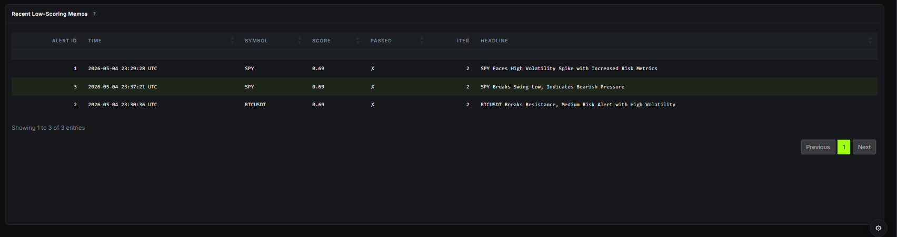
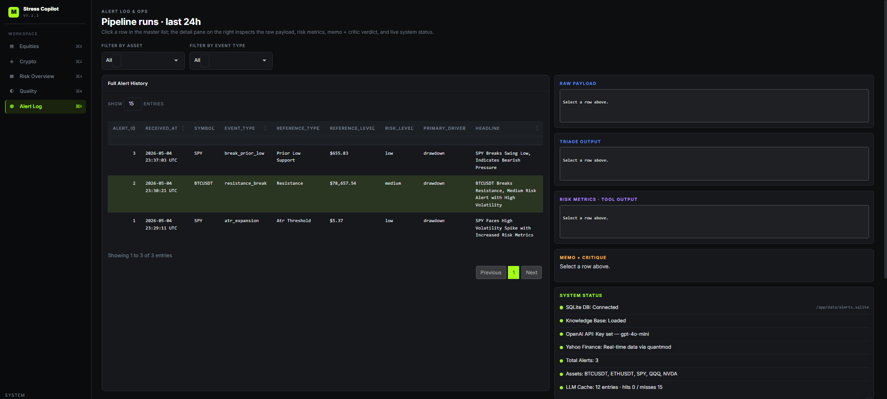
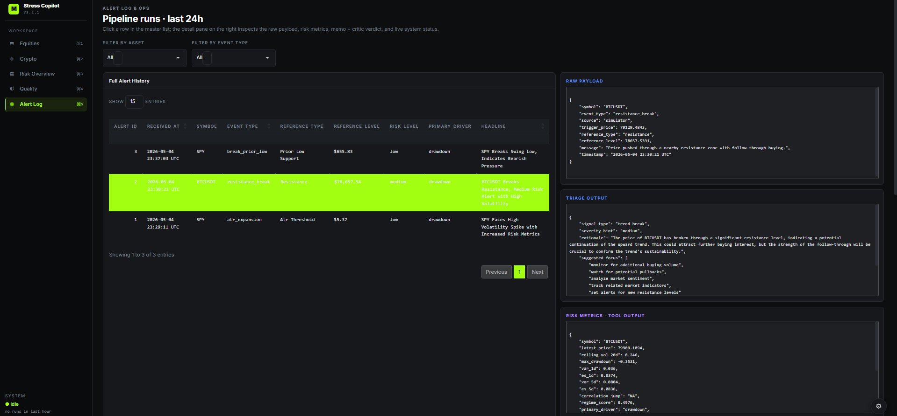
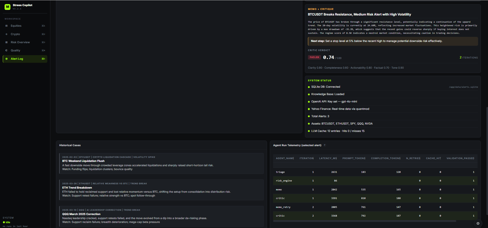

# Market Stress Copilot - App V3 Live Demo Script

**Live app:** https://stingray-app-l8znn.ondigitalocean.app/  
**GitHub repo:** https://github.com/yw2877/5381-APP-Tool  
**Format:** live app walkthrough with screenshots as backup  
**Target length:** 5-7 minutes

---

## 1. App V3 Overview

**Speaker script**

Today we are presenting **Market Stress Copilot**, our App V3 production-ready Shiny application. It is deployed live on DigitalOcean, and its goal is to turn a noisy market alert into a short, useful risk briefing.

The main upgrade from our earlier version is that this is no longer just a market dashboard. App V3 now has a multi-agent workflow: it classifies an alert, calculates risk metrics, writes a memo, checks that memo with a Critic Agent, and records quality evidence. On this screen, the left side shows market context, while the right side shows the AI pipeline and quality control.

---

## 2. Stakeholders and Core Workflow

**Speaker script**

The app is designed for three main users. A **trader** needs to know what happened and what action to take next. A **risk officer** needs context, such as risk metrics and historical stress cases. A **quant or operations user** needs transparency into whether the AI pipeline is working reliably.

The equities dashboard supports assets like **SPY**, **QQQ**, and **NVDA**. For each asset, the top KPI row gives a quick risk snapshot: latest price, 20-day volatility, max drawdown, 1-day VaR, regime score, and the latest alert. This makes the app usable as a fast monitoring tool rather than a long report generator.

---

## 3. Multi-Asset Support

**Speaker script**

The same workflow also supports crypto assets. Here we are looking at **BTCUSDT**, and the dropdown also supports **ETHUSDT**.

This matters because the app is not hardcoded for one ticker. It uses the same dashboard structure across equities and crypto: select an asset, review the market risk snapshot, inspect the chart, and read the AI-generated risk analysis.

---

## 4. Agentic Loop and Quality Gate

**Speaker script**

This is the most important App V3 feature. The **Agent Pipeline Trace** shows how an alert moves through the system.

First, the **Triage Agent** classifies the alert type and severity. Then the **Risk Engine Agent** computes deterministic risk metrics from market data. Next, the **Memo Agent** writes the executive risk memo. Finally, the **Critic Agent** evaluates the memo.

If the first memo is not good enough, the Critic Agent can issue rewrite feedback and the Memo Agent runs again. That is the agentic loop. The app is not just asking an AI for one answer; it is checking the answer and improving it when needed.

The **Critic Dimensions** panel shows the quality scores for clarity, completeness, actionability, factual alignment, and tone. This is our quality-control mechanism.

---

## 5. Cross-Asset Risk Overview

**Speaker script**

The **Risk Overview** page gives a cross-asset view across BTCUSDT, ETHUSDT, SPY, QQQ, and NVDA. Instead of looking at one ticker at a time, users can compare risk across the whole set of supported assets.

The cards and table show price, volatility, drawdown, VaR, regime score, risk level, and the primary risk driver. Below that, the app also includes risk terms and playbook guidance, so the dashboard explains both the numbers and how users should interpret them.

---

## 6. Quality Dashboard

**Speaker script**

The **Quality Dashboard** is the clearest evidence that App V3 validates AI performance. It shows total alerts, average quality score, pass rate, average iterations, quality score over time, dimension breakdown, and iteration distribution.

This means the app does not only generate AI text; it monitors whether the AI output is good enough. For our evaluation, we also compared V2 with V3. The old V2 single-pass pipeline had a Critic pass rate of **13.33%**, while the V3 critic-loop pipeline improved to **80.00%**. The average Critic score improved from **0.7286** to **0.7768**.

---

## 7. Low-Scoring Outputs

**Speaker script**

The app also shows recent low-scoring memos. This is useful because quality control should not only report averages; it should also help the team find specific cases where the AI output was weak.

In a production setting, this view would help the team investigate prompt issues, edge cases, or market events where the AI needs better guidance.

---

## 8. Alert Log and Operations

**Speaker script**

The **Alert Log & Ops** page is the operational view. On the left, we have the full alert history. On the right, the app has inspection panels for the raw payload, triage output, risk metrics, memo and critique, and system status.

This makes the app more reliable and transparent. If a memo looks wrong, we can inspect what payload came in, what the Triage Agent produced, what risk metrics were calculated, and what the Critic Agent said.

---

## 9. Inspecting One Alert

**Speaker script**

When we select an alert, the app shows the raw JSON payload, the Triage Agent output, and the Risk Engine tool output. This is important because it separates deterministic tool output from AI interpretation.

The Risk Engine calculates metrics like rolling volatility, max drawdown, VaR, expected shortfall, regime score, and primary driver. The AI memo is grounded in those structured metrics, which helps reduce hallucination risk.

---

## 10. Memo, Critique, and Telemetry

**Speaker script**

This final operations view shows the generated memo, the Critic verdict, historical cases, system status, and agent run telemetry.

The memo gives a trader a short explanation and a recommended next step. The Critic verdict shows whether the memo passed, the score, and the number of iterations used. The telemetry table shows latency, prompt tokens, completion tokens, retries, cache hits, and validation status for each agent.

This is what makes the app production-ready: it gives a useful final answer, but it also shows how that answer was produced and whether the AI system behaved reliably.

---

## 11. Closing

**Speaker script**

To summarize, **Market Stress Copilot** is a production-ready multi-agent risk dashboard. It takes a market alert, computes real risk metrics, generates a risk memo, checks the memo with a Critic Agent, and shows quality evidence in the app.

The most important App V3 upgrade is the quality-control loop. Instead of trusting the first AI answer, the system scores it, tracks it, and can revise it. That directly supports the assignment goals: stakeholder value, clarity, efficiency, reliability, quality validation, and live deployment.

---

## Backup Line if the Live App Is Slow

If the live app is slow during the presentation, say:

The app is deployed live, but because the pipeline calls external services like OpenAI and Yahoo Finance, some actions may take a few seconds. We prepared screenshots of the completed workflow so we can still show the full user experience and quality-control process.

