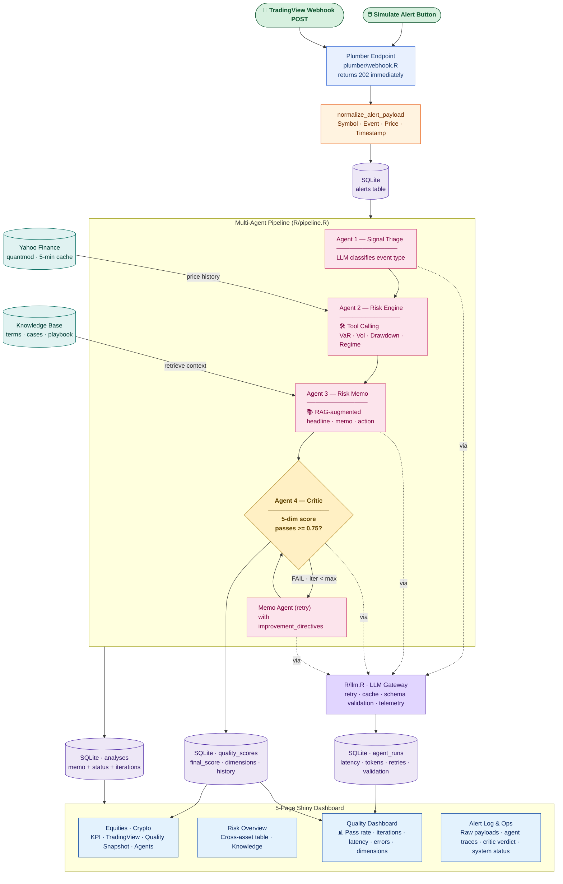

# V3 Process Diagram

## Data Flow: Market Stress Copilot — Multi-Agent Risk Dashboard with Critic Loop

## V3 vs V2: what's new

| Aspect | V2 | V3 |
|---|---|---|
| Pipeline shape | Linear: Triage → Risk → Memo | **Loop**: Triage → Risk → Memo → Critic → (Memo retry) |
| Quality Control | None — every memo shipped as-is | Critic Agent scores every memo on 5 dimensions; loop regenerates if score < 0.75 |
| LLM error handling | `stop()` on first failure | Exponential-backoff retry · schema validation · degraded fallback |
| Telemetry | None | Per-call latency / tokens / retries / errors in `agent_runs` |
| Quality evidence | None | Quality Dashboard with 6 KPIs, time-series, dimension breakdown, iteration distribution, error rate |
| Webhook | Synchronous (blocks the response) | Returns 202, runs pipeline async via `later::later()` |
| Yahoo failure mode | Hard error | Stale-cache fallback with banner |
| Deployment | Shiny only | Shiny + webhook + shared SQLite volume + healthchecks |
| RAG context | Used once before memo | Same — but now the Critic checks that the memo actually cites the retrieved context |

## Component Summary

| Layer | Component | Technology |
|---|---|---|
| Input | Simulate / TradingView Webhook | Shiny + Plumber |
| Gateway | LLM call wrapper | `R/llm.R` (retry, cache, schema, telemetry) |
| Agent 1 | Signal Triage | OpenAI GPT (LLM classification) |
| Agent 2 | Risk Engine | Tool Calling → quantmod + custom R functions |
| Agent 3 | Risk Memo | RAG → local CSV/TXT knowledge base + retry-aware prompt |
| Agent 4 | Critic *(NEW)* | OpenAI GPT (5-dim quality scoring + improvement directives) |
| Storage | alerts · analyses · agent_runs · quality_scores | SQLite (volume-mounted in prod) |
| Market Data | Price history + risk metrics | Yahoo Finance via quantmod, 5-min cache, stale fallback |
| Frontend | 5-page dashboard | R Shiny + bslib + DT + plotly |
| Dashboard | Quality Dashboard *(NEW)* | Shiny + plotly box / bar / scatter / time-series |
| Deploy | Container orchestration | Docker Compose · Caddy · DigitalOcean droplet |
