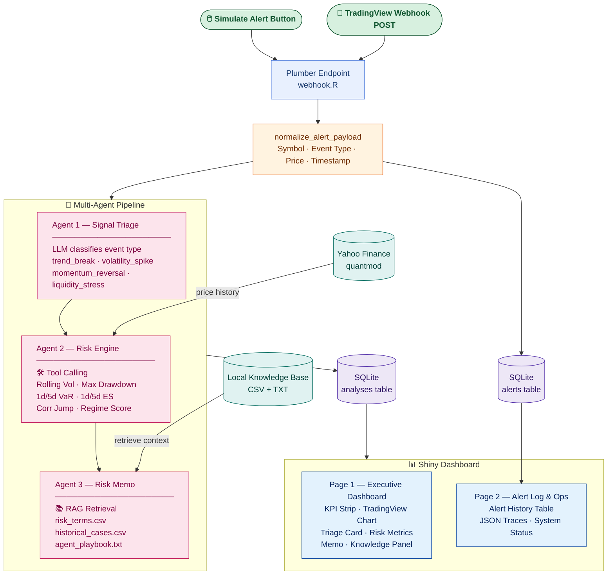

# App V2 Process Diagram

## Data Flow: TradingView Multi-Agent Risk Dashboard

## Component Summary

| Layer | Component | Technology |
|---|---|---|
| Input | Simulate Alert / TradingView Webhook | Shiny + Plumber |
| Ingestion | Payload normalization | R |
| Agent 1 | Signal Triage Agent | OpenAI GPT (LLM classification) |
| Agent 2 | Risk Engine Agent | Tool Calling → quantmod + custom R functions |
| Agent 3 | Risk Memo Agent | RAG → local CSV/TXT knowledge base |
| Storage | Alert + Analysis history | SQLite |
| Market Data | Price history | Yahoo Finance via quantmod |
| Frontend | Two-page dashboard | R Shiny + bslib + DT |
